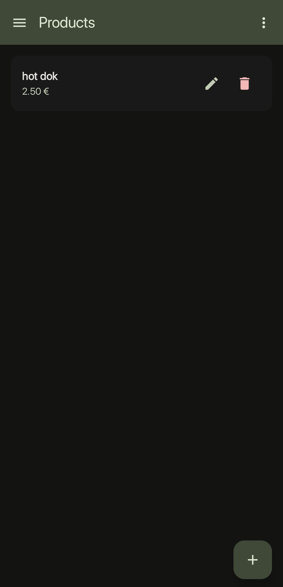

# Kelnar 🍽️

A cross-platform restaurant order management app built with Kotlin Multiplatform and Compose Multiplatform.

*[Slovenščina](README.sl.md) | English*

[**DEMO**](https://samolego.github.io/Kelnar/#menu/import?data=%5BFanta%3B2.5%3B0.25%20l%7CBurger%3B6.3%3BBeef%2C%20onions%2C%20tomato%7CIce%20Tea%3B2.5%3B0.5%20l%5D)

## Overview

Kelnar helps restaurant staff manage orders and menu items across Android, Desktop, and Web platforms. All data is stored locally - no internet connection required.

## Screenshots 📱

|  |  |  |
|:---:|:---:|:---:|
| Orders | New Order | Order Details |
|  |  |  |
| Products | Share | Complete Order |

## Platforms 📱

- **Android** (API 24+) 🤖
- **Desktop** (JVM) 💻
- **Web** (WebAssembly) 🌐

## Key Features

- Create and manage orders with table numbers
- Add products from searchable menu
- Track active and completed orders
- Manage restaurant menu items
- Share menu via QR codes and links 📲
- Import/export products between devices 🔄
- Local data storage (no cloud dependency) 💾

## Getting Started 🚀

### Prerequisites

- JDK 11+ ☕
- Android Studio or IntelliJ IDEA with Kotlin Multiplatform plugin

### Running the App

**Android:**
```bash
./gradlew :composeApp:assembleDebug
./gradlew :composeApp:installDebug
```

**Desktop:**
```bash
./gradlew :composeApp:run
```

**Web:**
```bash
./gradlew :composeApp:wasmJsBrowserDevelopmentRun
```

## Usage 📖

1. **Orders Tab** - View active and completed orders
2. **Create Order** - Add table number and select menu items
3. **Products Tab** - Manage menu items and prices
4. **Share Menu** - Generate QR codes and shareable links
5. **Import Products** - Scan QR codes or use links to import menu items
6. **Web Routes** - Direct URL access to different sections

## Data Storage

- **Android**: SharedPreferences 📱
- **Desktop**: Local files in `~/.kelnar/` 🗂️
- **Web**: Browser localStorage 🌐

## Tech Stack ⚡

- Kotlin Multiplatform
- Compose Multiplatform
- Material Design 3
- Navigation Compose
- Kotlinx Serialization
- QR Code Generation

## Project Structure 🏗️

```
composeApp/src/
├── commonMain/        # Shared code 🔗
├── androidMain/       # Android-specific 🤖
├── desktopMain/       # Desktop-specific 💻
└── wasmJsMain/        # Web-specific 🌐
```

## License 📝

Personal project showcasing Kotlin Multiplatform development.
