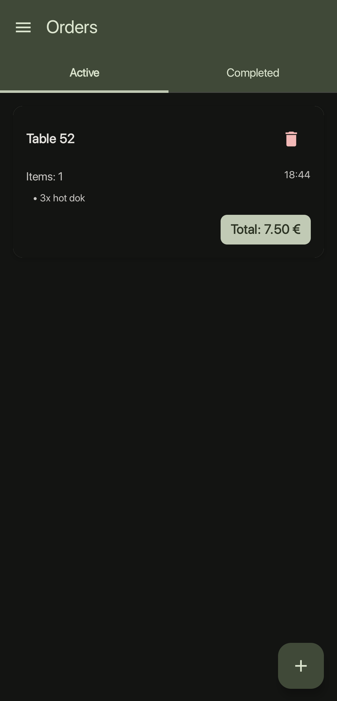
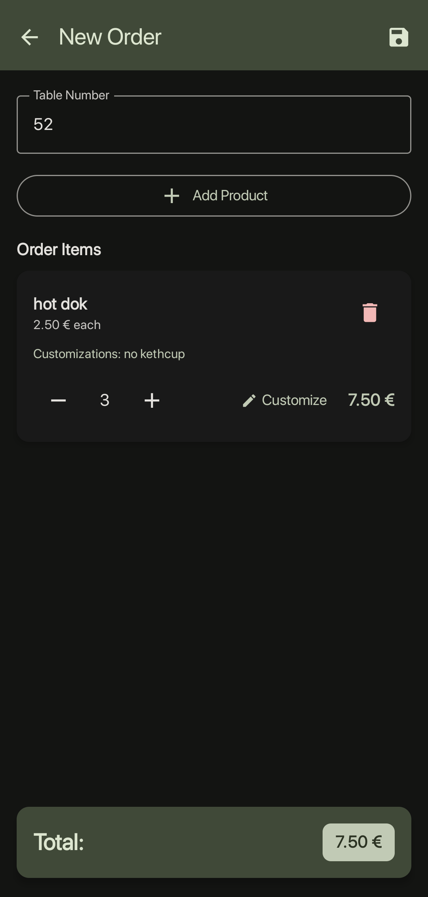
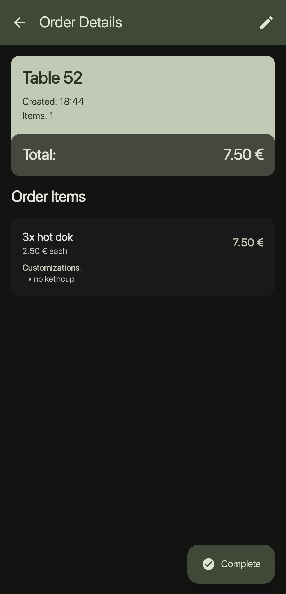
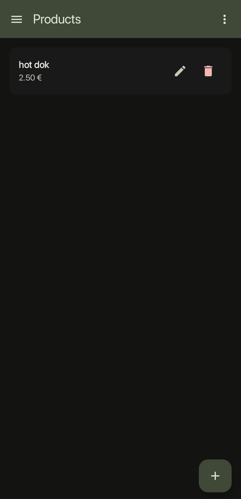
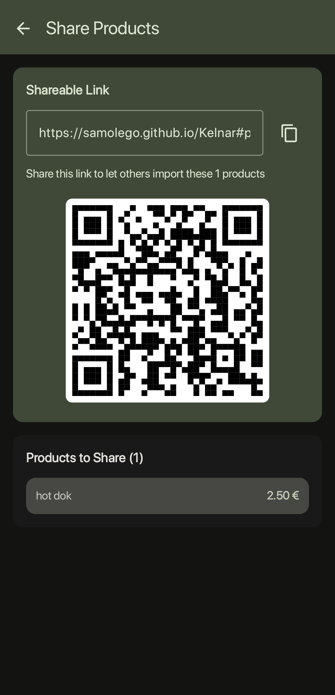
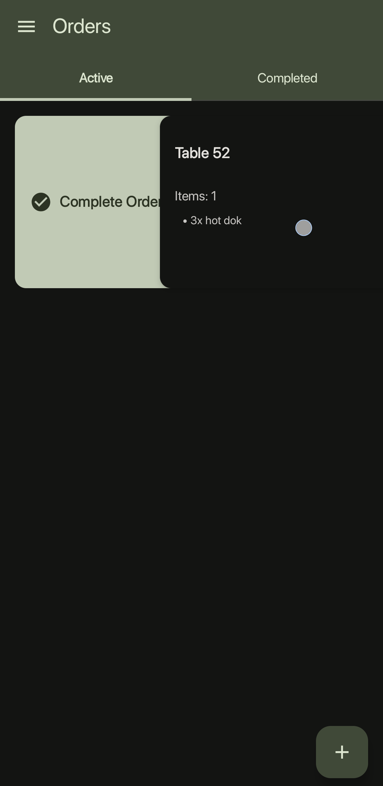

# Kelnar 🍽️

Aplikacija za upravljanje naročil na (gasilskih) veselicah, v restavracijah, ipd. zgrajena s Kotlin Multiplatform.

[**Demo**](https://samolego.github.io/Kelnar/#menu/import?data=%5BPica%20NMK%3B8.5%3BPica%20z%20gobicami%20gobicami%20in%20pa%C5%A1teto%7CHot%20Dog%3B3.0%7CCockta%3B2.5%7CJabol%C4%8Dni%20sok%3B1.5%5D)

## Pregled

Aplikacija Kelnar vam omogoča pregled nad naročili gostov. Vsi podatki so shranjeni na napravi - internetna povezava ni potrebna. Podpira tudi deljenje menija z ostalimi natakarji preko QR kod ali povezav.
V aplikaciji je možno dodati produkte (npr. hrano, ki jo prodajate) - nato pa ustvarjati račune. Skupna cena se samodejno posodablja ob dodajanju produktov.

## Kaj Kelnar omogoča?

- Ustvarjanje in upravljanje naročil z številkami miz
- Dodajanje izdelkov iz iskalnega menija
- Sledenje aktivnim in končanim naročilom
- Doajanje, brisanje in izdelkov v meniju
- Deljenje menija preko QR kod in povezav

## Zaslonske slike 📱

|  |  |  |
|:---:|:---:|:---:|
| Naročila | Novo naročilo | Podatki naročila |
|  |  |  |
| Produkti | Deljenje | Končanje naročila |

## Podprte platforme

- **Android** (API 24+) 🤖
- **Desktop** (JVM) 💻
- **Web** (WebAssembly) 🌐
